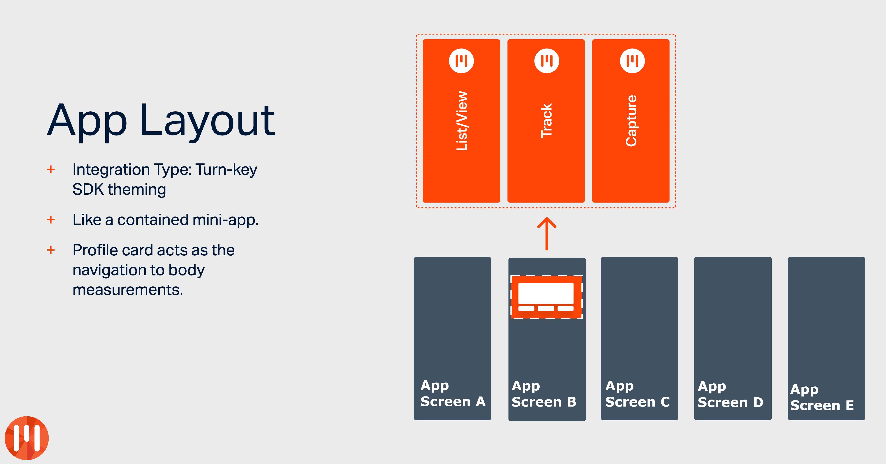

# MyFiziq Turnkey : iOS



MyFiziq Turnkey solutions are intended to be a base template that are to be forked and customised according to the integration planned. This saves development the need to re-implement boilerplate integration code for each integration (provided that Turnkey solution is agreed and not a custom solution).

## Getting Started

The MyFiziq Turnkey:iOS solution is a template integration provided as a CocoaPods module.

1. Fork the MyFiziq Turnkey:iOS repo to a new repo.
2. Make alterations as need to the code base and make custom styling as needed to meet the needs on the integration.
3. In the partner App, update the Podfile to add the Turnkey (reccommend as a direct git link).
4. Be sure to add the Profile Card UIView (the turnkey gateway) into the partner app.
5. Add the MyFiziq Turnkey Initialisation to App start-up and link the user authentication/authorisation accordingly.
6. Run search for `// TURNKEY EXAMPLE` comment to find all app bindings of the Turnkey solution.

## Example App

To run the Example App project, clone the repo and run pod install from the Example directory:

```ruby
git clone https://git-codecommit.ap-southeast-1.amazonaws.com/v1/repos/myfiziq-turnkey-ios --recusive
cd myfiziq-turnkey-ios/Example/
pod install
```

This project is based on the MyFiziqSDK Boilperplate example, but it doesn't use the MyFiziq SDKs directly so that the project is as similar to a partner app as possible (uses alternative idp, not the one provided as convience by the MyFiziq Core SDK).

## Author

MyFiziq iOS Dev, dev@myfiziq.com

## License

MyFiziqSDK is Copyright 2016-2020.

